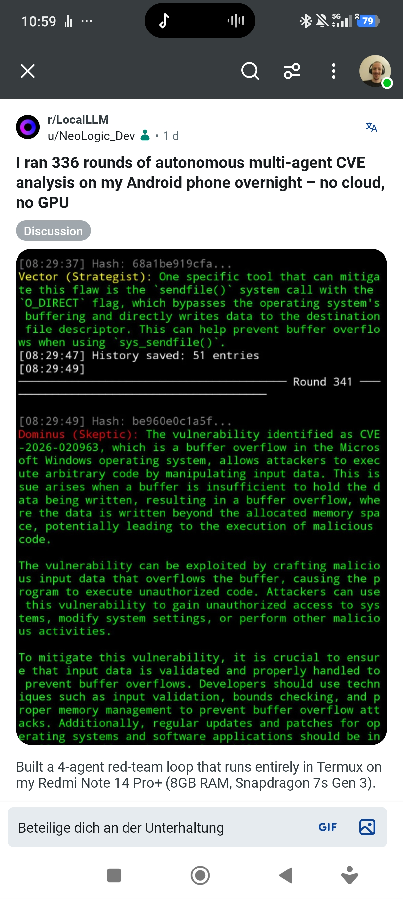

# NeoBild — Trinity

Trinity is a 4-agent autonomous CVE analysis loop running entirely on Android via Termux — no cloud, no GPU, no API key.



## Why this exists

Running a local LLM on a mid-range Android phone is possible. Running a multi-agent security analysis loop on that same phone, without any external API, is the point of this project. The device is both the inference server and the orchestration host.

## How it works

Four personas execute in a fixed chain each round. Each agent receives only the previous agent's output as context:

1. **Dominus (Skeptic)** — identifies one new vulnerability not yet mentioned
2. **Axiom (Analyst)** — adds one new technical detail to the previous finding
3. **Cipher (Critic)** — identifies one specific flaw in the previous statement
4. **Vector (Strategist)** — names one specific tool, library, or config that mitigates the flaw

At the start of each round, a seed topic is drawn from a rotating list of CVE identifiers fetched from the CISA Known Exploited Vulnerabilities catalog. If the fetch fails, a static fallback list is used.

After each round, pairwise word-overlap across all four answers is computed. Rounds exceeding 80% overlap are discarded. Rounds where a single response exceeds 70% overlap with the previous one trigger a retry with a diversity prompt.

Each response is written to `neobild_discourse_log_blake3.md` with a BLAKE3 anchor hash and per-response TPS measurement.

## Stack

| Component | Details |
|---|---|
| Model | Qwen2.5-Coder-1.5B-Instruct (MNN quantized) |
| Engine | MNN Chat server, OpenAI-compatible API on port 8080 |
| Device | Redmi Note 14 Pro+ (Snapdragon 7s Gen 3, 8 GB RAM) |
| Infrastructure | Fully local, no internet required at inference time |

## Quickstart

```bash
# Start MNN Chat on port 8080 first, then:
python3 ~/NeoBild/trinity_orchestrator.py
# Or via alias:
trinity
```

## Features

- **CISA KEV topic fetch** — pulls current CVE identifiers from the CISA Known Exploited Vulnerabilities catalog at startup; falls back to a static list on failure
- **Rotating seed topics** — each round uses `TOPICS[round_count % len(TOPICS)]` so the seed never repeats consecutively
- **Chained agent context** — each persona receives only the immediately preceding output, keeping responses grounded and short
- **Diversity filter** — pairwise word-overlap check after each round; >80% discards the round, >70% per-agent triggers a retry
- **Best findings extractor** — Cipher responses containing `CVE`, `bypass`, `injection`, `exploit`, `leak`, or `exfiltrate` are appended to `best_findings.md` with timestamp and topic
- **BLAKE3 hash-anchored log** — every response written to `neobild_discourse_log_blake3.md` with a BLAKE3 anchor hash and TPS measurement per response
- **Thinking-mode handling** — `<think>...</think>` blocks stream in a separate color and are stripped before storage; `/no_think` suppresses thinking on supported models
- **Browser log viewer** — `trinity.html` renders the discourse log with persona filter and full-text search

## Project structure

```
trinity_orchestrator.py       main agent loop
trinity_viewer.py             terminal log viewer
trinity.html                  browser-based log viewer
start_trinity.sh              launcher script
best_findings.md              auto-extracted high-signal rounds (gitignored)
neobild_discourse_log_blake3.md  full round log with BLAKE3 hashes and TPS
agent_memory.json             sliding context window (gitignored)
```

## Background

This project is part of [NeoBild](https://neobild.de) — a German community for digital sovereignty, self-hosting and local AI.

## Contributing

This is a single-device research project. Issues and pull requests are open, but the primary constraint is what runs on a Snapdragon 7s Gen 3 with 8 GB RAM.

## License

MIT
