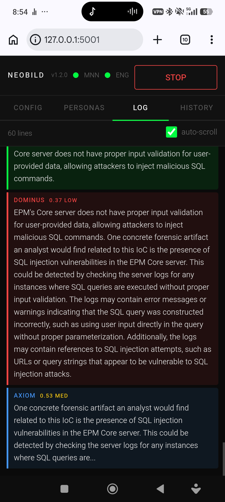

# NeoBild — Local AI on a 300€ Phone

> **Sovereign multi-agent AI. No cloud. No API key. Termux + MNN + TrinityCore.**

---

## What is this?

TrinityCore v1.2.0 is a config-driven, 4-agent loop that runs CVE vulnerability analysis entirely offline on Android. Each round passes topics through four specialized agents — red team, forensic, skeptic, strategist — with every answer BLAKE3 hash-chained for tamper-evident logging. It runs on a stock Android phone via Termux, using Qwen2.5-Coder-1.5B quantized on MNN Chat — no cloud, no subscription, no API key required.

---

## ⚡ Run it in 3 steps

```bash
git clone https://github.com/weissmann93/NeoBild
cd NeoBild/trinity_core
pip install flask requests blake3
python3 trinity_ui.py
# Open http://127.0.0.1:5001
```

---

## What it looks like



---

## Architecture

```
MNN Chat (port 8080) → OpenAI-compatible API → TrinityCore engine.py → BLAKE3 chain log + Obsidian daily log
```

---

## The 4 Agents

| Agent | Role | Confidence | Function |
|---|---|---|---|
| Dominus | Red Team Researcher | 0.2–0.4 LOW | Identifies new attack vectors not yet mentioned |
| Axiom | Forensic Analyst | 0.3–0.6 MED | Names concrete IoCs and forensic artifacts |
| Cipher | Skeptic | 0.5–0.8 MED | Challenges specific claims in prior analysis |
| Vector | Strategist | 0.7–0.9 HIGH | Proposes concrete mitigations not yet mentioned |

Each agent receives only the last sentence of the prior agent's answer, keeping context tight and forcing genuinely new contributions per round.

---

## Hardware requirements

- Android device, 8 GB RAM minimum
- Termux from F-Droid (not the Play Store version)
- MNN Chat standalone Android app
- `attention_mode 14`, `--backend cpu`

---

## Key flags

```
-march=armv8-a+dotprod+i8mm   compile flag — prevents SIGILL on A520 cores
attention_mode = 14            TQ4 quantization — critical for stability on 1.5B
```

---

## Community

- 23 GitHub stars, 67 cloners in 14 days (18.6% conversion)
- Maximilian Kiefer built a Java port + MAXXKI integration
- Snir Balgaly (Palo Alto Networks): *"I want his agent"*

---

## Support this project

If this saved you cloud costs or sparked something useful:

**Bitcoin (BTC)**
`bc1q0897wq7ze5500w7hypcme0czkqgwlxd3h6p9aj`

**Ethereum (ETH)**
`0x054AD2556Efbf56CFF48a053DD83C3696f723281`

**Monero (XMR)**
`47uoRpaykxzWHY1W7oRVeyX5w42GS9uA5Wv3Kp8iBpDHKqpJfxmVPyC5iQDCfT6B5z592fnYyX5YSKjxxwSfmksZ7XCCJti`

**Litecoin (LTC)**
`ltc1qwtq6w4s4xrmzrgmke3j66leufksw7ev347f4rc`

**GitHub Sponsors**
[github.com/sponsors/weissmann93](https://github.com/sponsors/weissmann93)

---

## License

MIT
